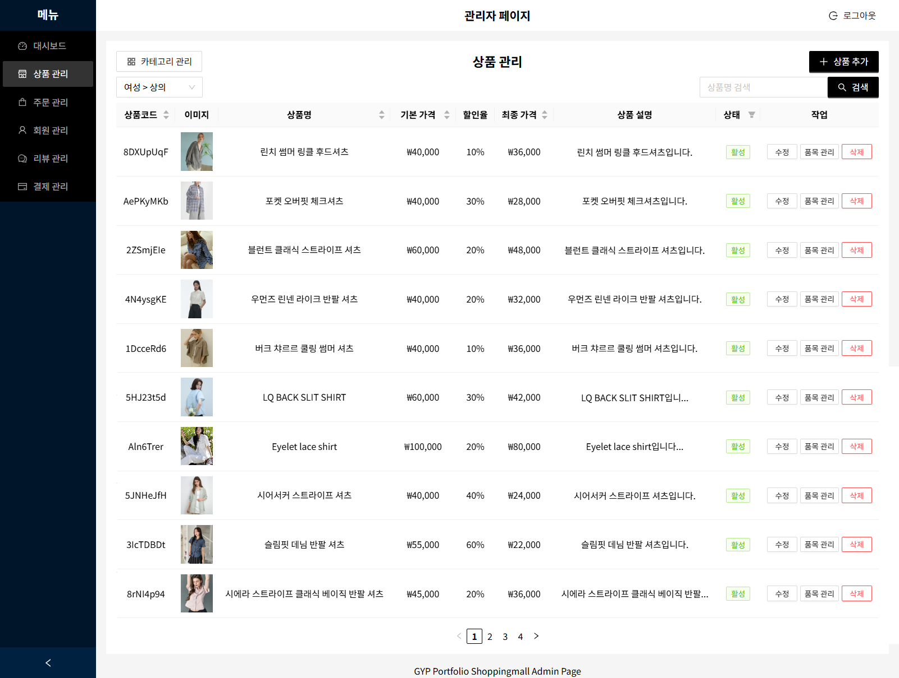

# E-Commerce Platform Portfolio

> 의류 및 패션 전문 풀스택 쇼핑몰 웹 서비스

이 프로젝트는 실무급 이커머스 플랫폼 구현을 목표로, **요구사항 분석부터 데이터 모델링, API 설계, 인프라 구축, 배포 및 운영**까지 전 과정을 직접 수행하며 풀스택 개발 역량을 종합적으로 증명하고자 시작되었습니다. 특히, 확장 가능한 **3단계 상품 DB 구조 설계**, 대용량 트래픽을 가정한 **고도화된 동시성 제어**, 그리고 **제한된 리소스 환경에서의 성능 최적화**에 초점을 맞추어 깊이 있게 학습하고 문제를 해결했습니다.


## 📺 데모

### 라이브 데모
- **데모 사이트**: 🔗 **[https://gyp-myportfolio.com/shopping-mall](https://gyp-myportfolio.com/shopping-mall)**
  - 💬 **체험 안내**: 본 데모 사이트는 회원가입을 통해 자유롭게 회원 계정을 만들 수 있습니다. 테스트 계정은 test1@test.com, test2@test.com, test3@test.com이 있으며, 비밀번호는 'testTEST1!' 입니다. 아직 개발 중인 포트원 결제 기능을 제외한 나머지 기능(회원가입, 로그인, 정보변경, 장바구니 담기 등)을 테스트해보실 수 있습니다.
- **관리자 페이지**: 🔗 **[https://gyp-myportfolio.com/shopping-mall/admin/login](https://gyp-myportfolio.com/shopping-mall/admin/login)**
  - 💬 **관리자 기능 체험 안내**: 본 데모 사이트의 관리자 기능을 테스트해보실 수 있습니다. 단, 아직 미완성된 기능(주문관리 페이지의 주문 상태별 작업 기능)은 테스트가 불가능합니다. 보안을 위해 공용 관리자 계정은 공개되어 있지 않으니, 필요하신 경우에는 **연락처 항목의 이메일**로 연락해주시기 바랍니다.
- *호스팅: AWS Lightsail*

> ⚠️ **현재 상태**: 포트원 결제 시스템 연동 및 주문 관리 기능 구현 진행 중 (약 85% 완성)

### 스크린샷

#### 🖥️ 데스크톱 버전
| 홈페이지 | 상품 목록 |
|:---:|:---:|
| [](./screenshots/01_homepage_desktop.png) | [](./screenshots/02_product_list_desktop.png) |
| **상품 상세** | **장바구니** |
| [](./screenshots/03_product_detail_desktop.png) | [](./screenshots/04_cart_desktop.png) |
| **주문 내역** | |
| [](./screenshots/05_order_info_desktop.png) | |

#### 🔧 관리자 페이지
| 대시보드 | 상품 관리 |
|:---:|:---:|
| [](./screenshots/06_admin_dashboard_desktop.png) | [](./screenshots/07_admin_product_management_desktop.png) |
| **주문 관리** | |
| [](./screenshots/08_admin_order_management_desktop.png) | |

#### 📱 모바일 반응형
| 홈페이지 | 상품 목록 |
|:---:|:---:|
| [](./screenshots/09_homepage_mobile.png) | [](./screenshots/10_product_list_mobile.png) |

### 📝 상품 이미지 출처
본 포트폴리오 프로젝트의 상품 이미지는 [무신사(MUSINSA)](https://www.musinsa.com)에서 제공하는 이미지를 사용했습니다. 
이는 포트폴리오 개발 목적으로만 사용되며, 상업적 이용이 아닌 기술 시연을 위한 것입니다.


## 🎯 주요 특징 및 기술적 하이라이트

### 🔐 보안 중심 설계
- **상태 비저장(Stateless) 인증 시스템 고도화**: 일반적인 JWT의 한계를 극복하기 위해 **Access/Refresh 토큰 이중화 구조**를 도입. 특히 **Redis를 활용한 토큰 블랙리스트**를 구현하여, 사용자가 로그아웃 시 즉시 토큰을 무효화함으로써 탈취된 토큰의 재사용 공격을 원천 차단합니다.
- **데이터 유형별 최적화된 다층 암호화**: 비밀번호는 복구가 불가능하도록 **bcrypt 단방향 암호화**를, 전화번호 등 민감 개인정보는 안전한 복호화가 가능하도록 **PBKDF2 키 유도 함수와 결합된 AES-256 양방향 암호화**를 적용하여 데이터의 특성에 맞는 최적의 보안을 구현했습니다.
- **세밀한 접근 제어 및 민감 정보 보호**: Spring Security의 URL 패턴 매칭과 메서드 레벨 보안(`@PreAuthorize`)을 조합하여 사용자 역할(User, Admin)에 따른 **최소 권한 원칙**(Principle of Least Privilege)을 적용하고, 모든 민감 정보(.env)를 소스 코드에서 분리하여 외부 노출을 방지합니다.

### ⚡ 고성능 동시성 제어
- **상황에 맞는 최적의 잠금(Lock) 전략**: 동시 주문으로 인한 재고 불일치 문제를 해결하기 위해, 충돌이 빈번한 재고 차감 로직에는 **비관적 락**(Pessimistic Lock, FOR UPDATE)을, 충돌 가능성이 낮은 주문 상태 변경에는 **낙관적 락**(Optimistic Lock, version 컬럼)과 **AOP**를 조합하여 적용함으로써 불필요한 성능 저하 없이 데이터 일관성을 확보했습니다.
- **경합 범위(Contention Scope) 최소화 설계**: 재고 차감 시 발생하는 락의 범위를 최소화하여 전체 시스템의 처리량을 높이기 위해, 상품 정보를 **'상품 마스터 → 상품 품목 → 재고'** 의 3단계로 세분화하여 설계했습니다. 이를 통해 특정 상품의 재고 변경이 다른 상품에 미치는 영향을 차단했습니다.
- **트랜잭션 격리 수준을 통한 데이터 무결성 강화**: 하나의 트랜잭션이 다른 트랜잭션에 의해 영향을 받는 것을 방지하기 위해, 모든 주문 및 재고 관련 트랜잭션에 `REPEATABLE_READ` **격리 수준**을 명시적으로 적용했습니다. 이를 통해 **팬텀 리드(Phantom Read)**와 같은 데이터 부정합 현상을 방지하고 데이터의 무결성을 보장합니다.

### 💳 실시간 테스트 결제 시스템 *(API 설계 및 초기 연동 완료)*
- **크로스 플랫폼 결제창 연동 구현**: 포트원(Toss Payments) V1 API를 연동하여, 데스크톱에서는 **팝업(Popup)**, 모바일에서는 **리디렉션(Redirection)** 방식으로 결제창이 동적으로 호출되도록 구현했습니다. 이를 통해 각 디바이스에 최적화된 초기 결제 흐름을 제공합니다.
- **비동기 웹훅 기반 결제 처리 설계**: 결제 완료, 실패, 취소 등 다양한 시나리오에 실시간으로 대응하기 위해 **비동기 웹훅(Webhook)을 수신하고 검증하여 DB 상태를 동기화**하는 백엔드 로직을 설계했습니다. *(현재 프론트엔드 연동 및 최종 테스트 진행 중)*
- **결제 데이터 정합성 확보 계획**: 결제 요청 전 주문 정보의 유효성을 사전 검증하고, 웹훅 수신 시 포트원의 결제 데이터와 서버의 주문 데이터를 교차 검증하여 결제 누락 및 오류를 방지하는 안정적인 시스템을 구축할 예정입니다.

### 🎨 현대적 풀스택 아키텍처
- **컴포넌트 기반 반응형 UI 구축**: React 18과 Ant Design을 활용하여 재사용 가능한 UI 컴포넌트를 설계하고, 768px을 분기점으로 한 **모바일 우선(Mobile-First) 접근 방식**의 반응형 디자인을 구현하여 모든 디바이스에서 일관된 사용자 경험을 제공합니다.
- **유연하고 독립적인 개발/배포 환경**: 백엔드(Spring Boot)와 프론트엔드(React)를 **완전히 분리된 헤드리스(Headless) 아키텍처**로 설계하여, 각 스택의 독립적인 개발, 테스트, 배포가 가능하도록 구현했습니다. 이는 팀의 생산성과 시스템의 확장성을 극대화하는 기반이 됩니다.
- **환경 분리를 통한 안정성 및 성능 확보**: 개발(dev)/스테이징(staging)/운영(prod) 환경을 위한 **스프링 부트 멀티 프로파일**(Multi-profile)을 도입하고, **Redis를 활용한 캐싱 전략**(인증 토큰)을 통해 DB 부하를 경감시켜 시스템 전체의 안정성과 응답 속도를 향상시켰습니다.

### 🧹 고급 성능 최적화
- **Java 메모리 최적화**: Integer 캐싱 메커니즘의 한계를 파악하고, 큰 숫자 비교 시 발생할 수 있는 잠재적 버그를 `equals()` 활용으로 원천 차단
- **MyBatis 캐시 제어**: 데이터 변경 후에도 이전 데이터가 조회되는 현상을 MyBatis L1 캐시 문제로 진단하고, `flushCache`와 `useCache` 옵션을 전략적으로 사용하여 실시간 데이터 동기화 보장
- **다층 캐싱 전략**: Cloudflare(Edge)와 Nginx(Web Server)를 조합하여 API 요청 및 정적 자원(CSS, JS) 로딩 속도를 극적으로 개선
- **AWS 인프라 최적화**: 메모리가 제한된 저사양 클라우드 서버(AWS Lightsail) 환경에서 JVM 힙 메모리 튜닝, 스왑 메모리 설정, Gradle 데몬 비활성화를 통해 풀스택 애플리케이션의 안정적인 운영 환경 구축

### 🛡️ 체계적 서버 보안 & 운영
- **Cloudflare DDoS 보호**: API 엔드포인트와 정적 자원을 분리하는 Page Rules를 세밀하게 설정하여 비정상 트래픽으로부터 핵심 API 서버 보호
- **AWS 비용 관리**: 예산 알림과 제로 지출 모니터링 시스템을 구축하여 클라우드 비용을 통제
- **자동 복구 시스템**: systemd를 활용하여 예기치 않은 메모리 부족(OOM)으로 백엔드 프로세스 다운 시 10초 내 자동 재시작되도록 구성


## 🛠 기술 스택

### Backend
- **Framework**: Spring Boot 2.7.16 (Java 17)
- **Security**: Spring Security + JWT + Redis
- **Database**: MyBatis + MariaDB
- **Infrastructure**: AWS Lightsail + Nginx + Cloudflare
- **External APIs**: PortOne (결제-*개발 중*), JavaMail (이메일 발송)
- **Concurrency**: AOP 기반 낙관적 락, 비관적 락

### Frontend
- **Framework**: React 18.2.0
- **UI Library**: Ant Design 5.24.7
- **Styling**: Styled Components 6.1.17
- **Routing**: React Router DOM 7.5.0
- **HTTP Client**: Axios 1.8.4
- **State Management**: React Context API
- **External APIs**: PortOne 결제, 다음 우편번호 API


## 📝 API 설계
이 프로젝트는 RESTful 원칙을 준수하여 설계되었으며, 총 5개의 도메인으로 구분된 60개 이상의 API 엔드포인트를 제공합니다. 각 API는 역할 기반의 명확한 권한 제어(Public, User, Admin)를 통해 안전하게 데이터를 관리합니다.

모든 API의 상세 명세(Endpoint, HTTP Method, Request/Response 등)는 아래의 별도 가이드 문서에서 확인하실 수 있습니다.

**👉 [전체 API 명세서 보러 가기 (API Guide)](./API_GUIDE.md)**


## 🚀 구현된 주요 기능

### 👥 사용자 시스템
- [x] **완전한 회원 라이프사이클 관리**: 이메일 중복 검사, 비밀번호 암호화를 포함한 신규 가입부터, 안전한 정보 수정, 그리고 Soft Delete 방식의 회원 탈퇴까지 사용자의 전체 생명주기를 지원합니다.
- [x] **토큰 기반의 안전한 인증**: 상태 비저장(Stateless) 환경의 보안을 강화하기 위해 **JWT 이중 토큰(Access/Refresh) 인증 시스템**을 구축했습니다. Redis를 활용한 토큰 블랙리스트로 즉각적인 로그아웃을 지원하며, JavaMail을 연동하여 이메일 인증 기반의 안전한 비밀번호 재설정 기능을 제공합니다.
- [x] **체계적인 개인정보 보호**: `bcrypt`와 `AES-256` 암호화를 통해 비밀번호와 전화번호 등 민감 정보를 안전하게 보호하며, 모든 로그인 시도를 기록하여 비정상 접근을 추적할 수 있도록 설계했습니다.

### 🛍️ 쇼핑 경험
- [x] **다차원적 상품 탐색**: 3단계 재귀 구조의 카테고리 네비게이션과 키워드 검색, 6가지 정렬 옵션(최신순, 인기순 등)을 조합하여 사용자가 원하는 상품을 빠르고 정확하게 찾을 수 있습니다.
- [x] **사용자 이탈 방지 주문 프로세스**: 로컬 스토리지와 계정 정보를 연동한 스마트 장바구니부터, 다음 우편번호 API를 활용한 주소 입력 자동화, 그리고 최종 결제까지 사용자의 불편함을 최소화하는 직관적인 주문 경험을 설계했습니다.
- [x] **고도화된 실시간 재고 관리**: 동시 주문 시 발생할 수 있는 재고 불일치 문제를 해결하기 위해 **비관적/낙관적 락을 조합**하여 데이터 정합성을 확보했습니다. 특히, '예약 수량' 개념을 도입하여 주문 즉시 재고를 예약 처리함으로써 재고 수량 초과 주문을 원천적으로 방지합니다.

### 💳 결제 & 주문 관리 *(백엔드 API 설계 완료, 프론트엔드 연동 개발 중)*
- [x] **테스트 결제 연동**: 포트원(Toss Payments) V1 API 연동 및 결제창 호출 구현 (PC/모바일)
- [ ] **결제 완료 및 웹훅 처리**: 결제 성공/실패/취소에 따른 웹훅을 수신하여 DB 상태를 실시간으로 동기화하는 로직
- [x] **주문 상태 관리**: '결제대기'부터 '배송완료', '구매확정'까지 16개 이상의 세분화된 주문 상태 흐름 관리 API 설계 완료
- [ ] **반품/취소/교환**: 관리자 및 회원의 요청을 처리하고 재고와 결제 금액을 업데이트하는 워크플로우 API 구현

### 📝 리뷰 시스템
- [x] **신뢰도 높은 검증된 리뷰**: 주문 내역 테이블과 연동하여 **'구매 확정' 상태의 사용자만 리뷰를 작성**할 수 있도록 제한하고, 주문 상품당 1개의 리뷰만 허용하여 어뷰징을 방지하고 데이터 신뢰도를 확보했습니다.
- [x] **직관적인 리뷰 상호작용**: 사용자는 마이페이지에서 자신이 작성한 리뷰를 손쉽게 수정하거나 삭제할 수 있으며, 상품 상세 페이지에서는 해당 상품에 대한 모든 리뷰를 평점과 함께 한눈에 확인할 수 있습니다.

### 🔧 관리자 대시보드
- [x] **통합 비즈니스 데이터 관리**: 회원 관리부터 **3단계 상품(마스터/품목/재고) 관리**, 16가지 이상의 복잡한 주문 상태 추적, 결제 및 리뷰 데이터 조회까지, 쇼핑몰 운영에 필요한 모든 핵심 데이터를 통합적으로 관리할 수 있는 기능을 제공합니다.
- [x] **실시간 비즈니스 인텔리전스**: 핵심 비즈니스 지표(총 매출, 주문 수, 신규 가입자 등)를 API와 연동하여 **실시간으로 시각화**함으로써 관리자가 서비스 현황을 직관적으로 파악하고 데이터 기반 의사결정을 내릴 수 있도록 지원합니다.
- [x] **강력한 데이터 검색 및 필터링**: 날짜 범위, 복합 키워드, 다중 상태 필터 등 **다양한 검색 조건을 조합**하여 방대한 운영 데이터 속에서 원하는 정보를 정확하게 찾아낼 수 있는 강력한 검색 및 필터링 시스템을 구축했습니다.
> 💡 **관리자 페이지 데모**: 실제 운영 환경의 보안 원칙에 따라, 관리자 페이지는 메인 사이트에 링크가 노출되어 있지 않습니다. **별도의 URL로 직접 접속**하여 모든 기능을 확인해보실 수 있습니다. (상세 접속 정보는 `시작하기` 섹션에 있습니다.)

### 📱 사용자 경험
- [x] **완벽한 반응형 UI/UX**: 768px을 분기점으로, 데스크톱의 복잡한 테이블(Table)은 모바일에서 정보 중심의 카드(Card) 뷰로 자동 전환되는 등 **각 디바이스의 특성에 맞춰 UI/UX를 완벽하게 최적화**했습니다.
- [x] **일관성 있는 디자인 시스템**: Ant Design을 기반으로, 프로젝트의 아이덴티티를 담은 **커스텀 테마와 전역 스타일(`theme.js`)을 적용**하여 모든 페이지에서 일관되고 직관적인 사용자 인터페이스를 제공합니다.
- [x] **흐름이 끊기지 않는 스마트 네비게이션**: 사용자(Guest, User, Admin)의 **역할에 따라 접근 가능한 페이지를 엄격히 제어(`Route` 분리)**하며, 로그인 후에는 직전에 보고 있던 페이지로 자동 복귀시키는 등 사용자의 여정이 끊기지 않도록 설계했습니다.


## 🚧 개발 현황 및 로드맵

### 현재 완성도: 85%

#### ✅ 완료된 주요 기능
- 회원 관리 시스템 (가입, 로그인, 정보 수정, 탈퇴)
- 상품 관리 및 검색 시스템 (카테고리별 조회, 키워드 검색)
- 장바구니 및 주문 생성 프로세스
- 포트원 결제창 연동 (테스트 환경)
- 관리자 대시보드 (회원/상품/리뷰 관리)
- 리뷰 시스템 (작성, 수정, 삭제)
- JWT 이중 토큰 인증 시스템
- 반응형 UI/UX 디자인

#### 🔄 개발 진행 중
- **결제 완료 처리**: 포트원 테스트 결제 성공 후 DB 기록 시스템
- **주문 상태 관리**: 결제대기→결제완료→배송중→배송완료 상태 전환 로직 *(설계된 API를 프론트엔드에 연동)*
- **반품/취소/교환**: 관리자 및 회원 요청 처리 워크플로우 *(설계된 API를 프론트엔드에 연동)*

#### 📅 향후 개발 계획
- 결제 시스템 완성 및 주문 관리 시스템 구현
- 관리자 주문 처리 기능 고도화
- 성능 최적화 및 사용자 경험 개선

### 📝 알려진 제한사항
- 결제 테스트는 포트원 테스트 환경에서만 가능
- 일부 관리자 주문상태별 처리 기능과 일부 회원 주문상태별 처리 기능은 UI만 구현되어 있음
- 포트원 결제 후 DB 동기화 로직 개발 중


## 🚦 시작하기
> 이 가이드는 Ubuntu/Debian 환경을 기준으로 작성되었으며, 새로운 개발 환경에서 프로젝트를 성공적으로 실행하는 것을 목표로 합니다. 만약 설정 과정에서 문제가 발생하면, 주저하지 마시고 `연락처` 섹션의 이메일로 문의해 주세요.

<details>
<summary><strong>👉 로컬에서 프로젝트 실행하기 (클릭하여 펼치기)</strong></summary>

---

### 필수 요구사항
- **Java 17+** (OpenJDK 권장)
- **Node.js 16+** & **npm 8+**
- **MariaDB 10.6+**
- **Redis 6.0+**
- **Git 2.30+**

### 🔧 로컬 개발 환경 설정

#### 1. 저장소 클론
```bash
git clone https://github.com/Srable666/portfolio_shoppingmall_integrated
cd portfolio_shoppingmall_integrated
```

#### 2. 데이터베이스 설정
> **중요**: 모든 명령어는 `portfolio_shoppingmall_integrated` 프로젝트 루트 디렉토리에서 실행하는 것을 기준으로 합니다.

##### 방법 1: 스키마 파일 사용 (권장)
```bash
# 프로젝트에서 제공하는 스키마 파일로 데이터베이스 생성
mysql -u root -p < ./gyp_portfolio_shoppingmall/database/portfolio_shopping_mall_schema.sql
```

##### 방법 2: 수동 생성
```sql
-- MariaDB 접속 후 실행
CREATE DATABASE portfolio_shopping_mall_dev CHARACTER SET utf8mb4 COLLATE utf8mb4_general_ci;
CREATE USER 'portfolio_user'@'localhost' IDENTIFIED BY 'your_password';
GRANT ALL PRIVILEGES ON portfolio_shopping_mall_dev.* TO 'portfolio_user'@'localhost';
FLUSH PRIVILEGES;
```

> 💡 **참고**: 
> - 스키마 파일에는 **13개 테이블**의 완전한 구조가 포함되어 있습니다
> - 테스트 데이터는 별도로 제공되지 않으므로, 애플리케이션 실행 후 회원가입/상품등록을 통해 데이터를 생성하세요

#### 3. Redis 서버 실행
```bash
# macOS (Homebrew)
brew services start redis

# Ubuntu/Debian
sudo systemctl start redis-server

# Windows
redis-server
```

#### 4. 백엔드 환경 설정
```bash
cd gyp_portfolio_shoppingmall

# .env 파일 생성 (프로젝트 루트에)
touch .env
```

**.env 파일 내용 (필수 환경변수)**:
```env
# 데이터베이스 설정
DB_URL=jdbc:mariadb://localhost:3306/portfolio_shopping_mall_dev
DB_USERNAME=root  (또는 생성한 사용자)
DB_PASSWORD=your_password

# JWT 토큰 설정 (아래 명령어로 강력한 시크릿 키를 생성하여 사용하세요)
# openssl rand -base64 32
JWT_ACCESS_TOKEN_SECRET=your_access_token_secret_key_here
JWT_REFRESH_TOKEN_SECRET=your_refresh_token_secret_key_here
JWT_ACCESS_TOKEN_EXPIRATION=3600000
JWT_REFRESH_TOKEN_EXPIRATION=2592000000

# 이메일 설정 (Gmail)
MAIL_USERNAME=your_email@gmail.com
MAIL_PASSWORD=your_app_password

# 포트원 결제 테스트 설정
PORTONE_API_API_SECRET=your_portone_api_secret
PORTONE_API_PG_STORE_ID=your_store_id
PORTONE_API_PG_SECRET_KEY=your_pg_secret_key
PORTONE_API_PG_CLIENT_KEY=your_pg_client_key
PORTONE_API_BASE_URL=https://api.portone.io

# 암호화 설정 (아래 명령어로 강력한 키와 솔트를 생성하여 사용하세요)
# KEY: openssl rand -hex 32
# SALT: openssl rand -hex 16
PHONE_ENCRYPTION_KEY=your_32_character_encryption_key
PHONE_ENCRYPTION_SALT=your_16_character_salt

# MyBatis 캐시 설정(캐시 비활성화)
mybatis.configuration.local-cache-scope=STATEMENT
mybatis.configuration.cache-enabled=false
mybatis.configuration.lazy-loading-enabled=false
mybatis.configuration.aggressive-lazy-loading=false

# 도메인 설정
APP_DOMAIN=http://localhost:3000/shopping-mall
```

#### 5. 백엔드 실행
```bash
# 권한 부여 (macOS/Linux)
chmod +x ./gradlew

# 의존성 설치 및 실행
./gradlew bootRun

# 또는 Windows
gradlew.bat bootRun
```

#### 6. 프론트엔드 설정 및 실행
```bash
cd ../gyp_portfolio_shoppingmall_frontend

# 의존성 설치
npm install

# 개발 서버 실행
npm start
```

#### 7. 프론트엔드 환경변수 설정
```bash
# .env 파일 생성 (프론트엔드 루트에)
touch .env
```

**.env 파일 내용**:
```env
# 포트원 클라이언트 키 (결제 테스트용)
REACT_APP_PORTONE_IMP=your_portone_imp_code
```

### 🌐 접속 정보
- **애플리케이션 접속**: `http://localhost:3000/shopping-mall`
- **관리자 로그인 페이지**: `http://localhost:3000/shopping-mall/admin/login`

> 💡 **API 직접 테스트 가이드 (Postman 등)**
> React 개발 서버의 프록시를 통하지 않고 API를 직접 호출하려면, 백엔드 서버의 실제 주소인 `http://localhost:8080/shopping-mall/api/{엔드포인트}`로 요청해야 합니다.

### 🔧 트러블슈팅

<details>
<summary><strong>포트 충돌 오류</strong></summary>

**문제**: `Port 8080 already in use`
**해결**: 
```bash
# 포트 사용 중인 프로세스 확인
lsof -i :8080  # macOS/Linux
netstat -ano | findstr :8080  # Windows

# 프로세스 종료 후 재실행
```
</details>

<details>
<summary><strong>스키마 파일 실행 오류</strong></summary>

**문제**: `ERROR 1049: Unknown database`
**해결**: 
1. MariaDB 서버가 실행 중인지 확인
2. 파일 경로가 정확한지 확인
3. 권한 문제 시: `mysql -u root -p --default-character-set=utf8mb4 < 파일경로`
</details>

<details>
<summary><strong>데이터베이스 연결 오류</strong></summary>

**문제**: `Connection refused` 또는 `Access denied`
**해결**:
1. MariaDB 서버 실행 확인
2. `.env` 파일의 데이터베이스 정보 확인
3. 방화벽 설정 확인
</details>

<details>
<summary><strong>Redis 연결 오류</strong></summary>

**문제**: `Could not connect to Redis`
**해결**:
```bash
# Redis 서버 상태 확인
redis-cli ping  # PONG 응답 확인

# Redis 서버 재시작
sudo systemctl restart redis-server
```
</details>

<details>
<summary><strong>환경변수 로딩 오류</strong></summary>

**문제**: `Failed to load .env file`
**해결**:
1. `.env` 파일이 프로젝트 루트에 있는지 확인
2. 파일 권한 확인: `chmod 644 .env`
3. 환경변수 형식 확인 (공백, 특수문자 등)
</details>

### 📚 추가 리소스
- **데이터베이스 스키마**: [portfolio_shopping_mall_schema.sql](./gyp_portfolio_shoppingmall/database/portfolio_shopping_mall_schema.sql)
- **포트원 결제 테스트**: [포트원 개발자 문서](https://developers.portone.io/opi/ko/readme?v=v1)
- **환경 설정 가이드**: 위의 '시작하기' 섹션 참조

### 🔗 관련 기술 문서
- **Spring Boot**: [공식 문서](https://spring.io/projects/spring-boot)
- **React**: [공식 문서](https://react.dev/)
- **Ant Design**: [컴포넌트 라이브러리](https://ant.design/)

### ⚠️ 주의사항
- **실제 결제 방지**: 포트원 테스트 키만 사용하세요
- **환경변수 보안**: `.env` 파일을 Git에 커밋하지 마세요
- **포트 확인**: 8080(백엔드), 3000(프론트엔드) 포트가 사용 가능한지 확인하세요

> ---
> **설정에 어려움이 있으신가요?**
> 다양한 로컬 환경(OS, 설치된 프로그램 버전 등)의 차이로 인해 예기치 않은 문제가 발생할 수 있습니다. 만약 위 가이드대로 진행되지 않는 부분이 있다면, 이슈를 해결하는 과정 역시 개발의 일부라고 생각합니다. `연락처`의 이메일로 편하게 문의해주시면 함께 문제를 해결하고 가이드를 개선해 나가겠습니다.
</details>


## 🔧 개발 과정

### 📋 핵심 개발 여정
- **프로젝트 규모**: 13개 테이블, 60여 개 API, 20여 개 프론트엔드 페이지
- **주요 기술적 도전**: 
  - **아키텍처 설계 및 데이터 모델링**: 초기 단일 상품 구조에서 재고 관리, 옵션 관리의 한계를 발견하고, 이를 해결하기 위해 **'상품 마스터 → 상품 품목 → 재고'** 의 3단계 구조로 데이터베이스를 **점진적으로 리팩토링**하며 확장성과 데이터 정합성을 확보했습니다.
  - **인증 시스템 구축**: 상태 비저장(Stateless) 아키텍처를 위해 **JWT 이중 토큰(Access/Refresh)과 Redis 블랙리스트**를 조합하여, 보안성과 확장성을 모두 갖춘 인증 시스템의 기반을 마련했습니다.
  - **반응형 UI/UX 구현**: 디바이스 환경에 따라 레이아웃과 컴포넌트가 동적으로 변화하는 **모바일/데스크톱 반응형 디자인**을 구현하여, 초기부터 모든 사용자에게 최적화된 경험을 제공했습니다.
  - **복잡한 비즈니스 로직 설계**: 쇼핑몰의 핵심인 주문 프로세스를 위해 **16가지 이상의 세분화된 주문 상태**(`결제대기`~`교환완료`)와, 각 상태 전환에 따른 재고 및 결제 금액 변동 워크플로우를 체계적으로 설계하고 구현했습니다.
  - **고도화된 동시성 제어**: 대량 주문 상황을 가정하여, 데이터 무결성을 보장하기 위해 **`REPEATABLE_READ` 트랜잭션 격리 수준**을 적용하고, **비관적/낙관적 락**을 조합하여 동시성 문제를 해결했습니다. 특히 **Java의 Integer 캐싱 버그**로 인한 잠재적 오류를 디버깅하고 해결하며 시스템 안정성을 극한으로 끌어올렸습니다.
  - **민감 데이터 보안 강화**: 개인정보보호 규정을 준수하기 위해, `PBKDF2`와 `AES-256-GCM`을 결합하여 사용자의 **전화번호를 안전하게 양방향 암호화**하는 로직을 구현했습니다.
  - **결제 시스템 연동**: 포트원(Portone) V1 API 문서를 분석하고 연동하여, 데스크톱(팝업)과 모바일(리디렉션) 환경에 맞는 **크로스 플랫폼 결제창 호출** 기능을 구현했습니다. 향후 웹훅(Webhook) 처리를 통해 결제 상태를 실시간으로 동기화할 수 있는 기반을 설계했습니다.
  - **실시간 성능 최적화**: 사용자의 페이지 로딩 속도를 개선하기 위해, **Cloudflare의 다층 캐싱 전략**을 도입하여 API 서버의 부하를 줄이고 정적 콘텐츠의 응답 속도를 극적으로 개선했습니다.
  - **제한된 인프라 환경에서의 운영 최적화**: 저사양 클라우드 서버(AWS Lightsail)에서 **OOM(Out of Memory) 문제**를 해결하기 위해, **스왑 메모리 설정, JVM 옵션 튜닝, Nginx 정적 파일 오프로딩** 등 복합적인 인프라 튜닝을 통해 안정적인 운영 환경을 구축했습니다.

### 📚 상세 개발 과정
전체 개발 과정의 매우 상세한 기록과 기술적 의사결정 과정은 아래 링크에서 확인하실 수 있습니다.

**👉 [기술적 의사결정 및 트러블슈팅 전체 기록 보기 (Notion)](https://mysterious-meteoroid-685.notion.site/23219636adbd8091b0e9c8f29cebba3a?source=copy_link)**


## 📞 연락처

- **개발자**: 권용필
- **이메일**: srable6666@gmail.com
- **GitHub**: https://github.com/Srable666
- **포트폴리오 Hub**: https://gyp-myportfolio.com

---
